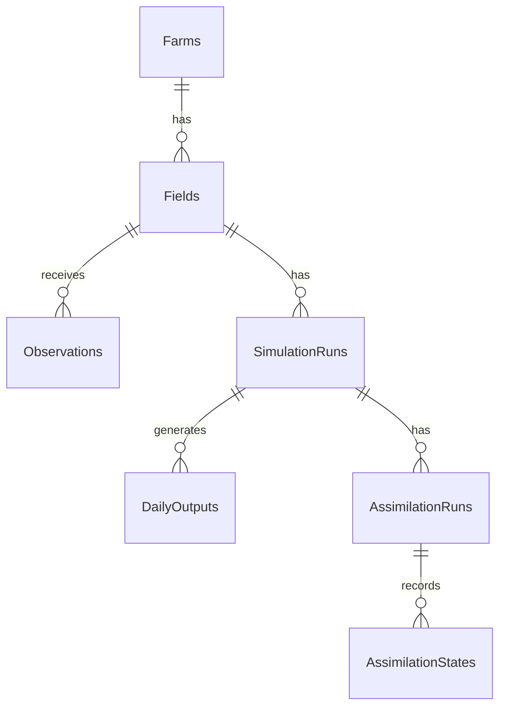

# AgriTwin Developer & LLM Context Specification

This document provides a complete, high-fidelity explanation of the AgriTwin repository's architecture, database design, and key system invariants. Use this file as context for any LLM agent to ensure zero hallucinations and smooth continuity of development.

---

## 🚀 1. Project Overview & Current Status
AgriTwin is a Python/FastAPI Agricultural Digital Twin platform. It uses the Wageningen **PCSE/WOFOST 7.2 (Water-Limited)** simulation engine to model crop development day-by-day. To prevent drift, it integrates satellite/sensor observations via an **Ensemble Kalman Filter (EnKF)** sequential assimilation loop.

**Current Status (June 2026)**:
*   **Database persistence**: Implemented using SQLAlchemy 2.0 + Alembic migrations.
*   **Weather/Soil providers**: Fully implemented with local file caching (`.agritwin_cache/`) for NASA POWER (weather) and SoilGrids (soil properties).
*   **Scenario Sweep Engine**: Operates deterministically to compare sowing dates, crop varieties, and irrigation events.
*   **Sequential EnKF Assimilation**: Completed. Successfully perturbs crop/soil parameters, builds ensembles, carries out mathematical updates on observations, registers cycle metrics, and injects updated variables back into the running PCSE model instances.
*   **Read-only APIs & Demos**: Implemented endpoints for status, step-by-step history, and daily comparative timeseries. The `run_demo_for_professor.py` automated script successfully runs this entire workflow.
*   **Verification**: All **290 unit and integration tests** pass successfully.

---

## 🗄️ 2. Database Schema & Relationships

The relational DB uses SQLAlchemy 2.0 (under SQLite for development, designed to migrate to PostgreSQL easily). The main entities are:



### Table Details
1.  **`farms`**: Grouping entity (ID, name, description).
2.  **`fields`**: Geospatial boundaries, lat/lon centroid, area (ha), elevation (m), and boundary GeoJSON.
3.  **`observations`**: External measurements (LAI, SM, etc.) containing:
    *   `source`: `satellite`, `sensor`, or `manual`.
    *   `variable`: e.g. `LAI`, `SM`.
    *   `value`: float value.
    *   `uncertainty`: std deviation (used for observation noise covariance $R$).
    *   `status`: `VALID` or `INVALID` (outliers).
4.  **`simulation_runs`**: Persists one crop simulation run. Stores:
    *   `run_type`: `baseline`, `irrigated`, `enkf`, etc.
    *   Agronomic metrics (`yield_kg_ha`, `peak_lai`, `harvest_index`, `final_tagp`, `final_twso`, `total_days`).
    *   Phenological dates (`dos`, `doe`, `doa`, `dom`, `doh`).
    *   JSON payloads (`request_payload`, `metrics_payload`, `summary_payload`, `weather_snapshot`, `soil_snapshot`).
5.  **`daily_outputs`**: High-frequency output data (one row per simulation day) containing daily state variables: DVS, LAI, SM, TAGP, TWSO, etc.
6.  **`assimilation_runs`**: Orchestrates EnKF runs. Stores:
    *   `simulation_id` (FK to `simulation_runs.id`).
    *   Status (`PENDING`, `RUNNING`, `COMPLETED`, `FAILED`).
    *   Diagnostics (`ensemble_size`, `total_cycles`, `executed_cycles`, `skipped_cycles`, `observations_used`).
7.  **`assimilation_states`**: Logs individual EnKF update cycles:
    *   `assimilation_run_id` (FK to `assimilation_runs.id`).
    *   `cycle_date`: date of update.
    *   Prior, posterior, and observation vector matrices stored as JSON blobs.
    *   Diagnostics: innovation, quality score, cycle number.

**Cascade Deletions**:
*   Deleting a `Field` purges all related `Observations` and `SimulationRuns`.
*   Deleting a `SimulationRun` purges all related `DailyOutputs` and `AssimilationRuns`.
*   Deleting an `AssimilationRun` purges all related `AssimilationStates`.

---

## ⚠️ 3. Crucial Architecture Invariants & Rules

When writing code or modifying this repository, **you must respect the following invariants**:

### A. The 14-Day Pre-Season Buffer Invariant
WOFOST simulation campaigns begin **14 days before the sowing date** to initialize soil water balances.
*   **Invariant**: Weather data MUST exist starting from `sowing_date - 14 days`.
*   **Ensemble Manager**: When building ensembles in `EnsembleManager`, the `start_date` passed to `create_weather_provider` must be `sow_date - timedelta(days=14)`. Passing `sow_date` directly will cause `WeatherDataProviderError` because the weather data bounds won't cover the pre-sowing period.

### B. FastAPI SQLite Concurrency Commits
Because FastAPI runs dependency yield blocks (`get_db`) asynchronously after returning the HTTP response, returning a simulation ID before committing the session leads to a race condition where the client requests assimilation using an ID that SQLite hasn't finished writing.
*   **Invariant**: Call `db.commit()` inside POST route handlers (e.g. `/simulate`, `/fields`) *before* returning the JSON response.

### C. Response Validation Contracts
*   `POST /fields` returns `FieldResponse` where the primary ID field is named `field_id` (not `id`).
*   `POST /simulate` returns `SimulateResponse` containing nested `metrics` (e.g. `final_twso_kg_ha`, `peak_lai`) and `summary` (e.g. `doe`, `doh`) blocks.

### D. EnKF State Perturbation Bounds
To keep ensemble members physically plausible and prevent PCSE engine crashes:
*   Crop parameters are perturbed by up to 10% standard deviation.
*   Soil moisture constraints MUST be strictly enforced: `SMW < SMFCF < SM0` (wilting point < field capacity < saturation). `SMFCF` and `SMW` must remain bounded away from `SM0` by at least `0.02`.

### E. Zero-Order Hold Offset Propagation
Because EnKF corrections are applied at discrete observation dates, the comparative daily timeseries API does not re-simulate. Instead, it computes the correction offset (posterior - prior) at the assimilation date and propagates it forward using a **Zero-Order Hold (ZOH)** offset until the next cycle or the season end. This creates a smooth comparative curve between open-loop and assimilated variables.

---

## 🛠️ 4. Code Execution & Class Flow

When `POST /assimilation/run` is called:
1.  **API Route Handler** (`assimilation_routes.py`):
    *   Fetches the baseline `SimulationRun` and target `Field`.
    *   Creates an `AssimilationRun` record with status `RUNNING`.
    *   Constructs the `EnsembleManager`.
2.  **Ensemble Initialization** (`ensemble_manager.py`):
    *   Creates $N$ `EnsembleMember` instances.
    *   Creates a `PerturbedWeatherProvider` for each member (adding random noise to radiation, temperature, and rainfall).
    *   Perturbs crop parameters (`SLATB`, `SPAN`, `TSUM1`, `TSUM2`) and soil parameters (`SMFCF`, `SMW`).
    *   Instantiates a step-by-step WOFOST model for each member.
3.  **Assimilation Loop** (`assimilation_service.py`):
    *   Discovers observation dates.
    *   For each date:
        *   Forecasts all members to the observation date (`forecast_until`).
        *   Retrieves observations and applies Quality Control (QC).
        *   Constructs state vectors (`StateVector`).
        *   If valid observations exist, executes `enkf_update` (`enkf.py`), updating the state matrix.
        *   Injects updated states back into each member's PCSE engine (`StateUpdater`).
        *   Persists the cycle details as `AssimilationState`.
4.  **Completion**:
    *   Status is updated to `COMPLETED` and statistics are saved.

---

## 💻 5. Standard Setup & Commands

Always use the virtual environment for operations:
```bash
# Activate environment
source venv/bin/activate

# Execute migrations
alembic upgrade head

# Run tests
pytest

# Start development server
python -m uvicorn backend.app.main:app --reload --host 0.0.0.0 --port 8000
```
